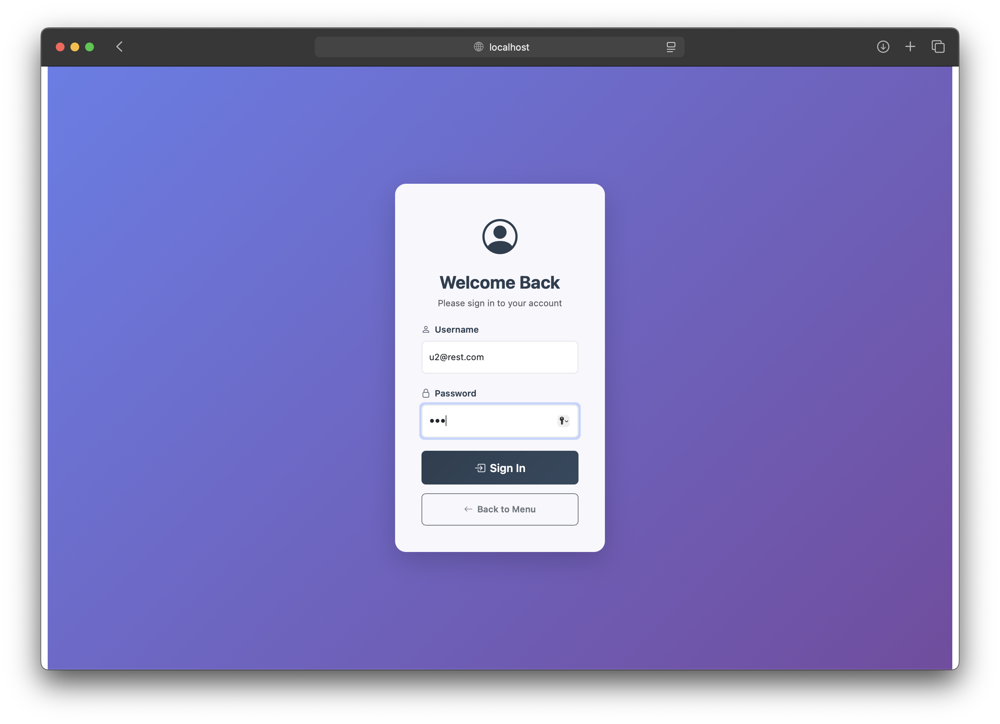

<!--  -->
# Exam #2: "Restaurant"

## Student: s345388 INNOCENTI ELIA 

Full-stack web application for restaurant ordering with user authentication, 2FA support, and ingredient constraint management.

## React Client Application Routes

- Route `/`: Public menu browsing page showing dishes, sizes, and ingredients with login prompts for non-authenticated users
- Route `/login`: Authentication page with username/password login and optional 2FA flow
- Route `/configure`: Order configuration page for authenticated users to create custom orders with ingredient selection
- Route `/orders`: User order history page showing confirmed/cancelled orders with cancellation functionality (requires 2FA)

## API Server

- POST `/api/sessions`
  - Request body: `{username: "user@example.com", password: "pwd"}`
  - Response: User object with 2FA status `{id: 1, username: "user@example.com", name: "User", canDoTotp: true, isTotp: false}`
- GET `/api/sessions/current`
  - No parameters required (uses session cookies)
  - Response: Current user object or 401 if not authenticated
- DELETE `/api/sessions/current`
  - No parameters required
  - Response: Empty object confirming logout
- POST `/api/login-totp`
  - Request body: `{code: "123456"}`
  - Response: Success confirmation object
- POST `/api/skip-totp`
  - No parameters required
  - Response: Success confirmation for partial authentication
- GET `/api/dishes`
  - No parameters required
  - Response: Array of dish-size combinations `[{id: "1_1", name: "Pizza Small", price: 8.50}]`
- GET `/api/base-dishes`
  - No parameters required
  - Response: Array of base dish types `[{id: 1, name: "pizza"}]`
- GET `/api/sizes`
  - No parameters required
  - Response: Array of sizes `[{id: 1, label: "Small", basePrice: 5.00, maxIngredients: 3}]`
- GET `/api/ingredients`
  - No parameters required
  - Response: Array of ingredients with constraints `[{id: 1, name: "mozzarella", price: 1.50, availability: 10, requires: ["tomatoes"], incompatible: []}]`
- GET `/api/orders`
  - No parameters required (requires authentication)
  - Response: Array of user orders with details and ingredients
- POST `/api/orders`
  - Request body: `{dishId: "1_2", ingredientIds: [1, 3, 5]}`
  - Response: Created order object with total price calculation
- DELETE `/api/orders/:orderId`
  - URL parameter: orderId (requires TOTP authentication)
  - Response: Success confirmation object

## Database Tables

- **`users`** - User authentication data
  - `id` (PK, auto-increment)
  - `email` (unique)
  - `name`
  - `hash` (password hash)
  - `salt`
  - `secret` (2FA secret)

- **`base_dishes`** - Available dish types
  - `id` (PK, auto-increment)
  - `name` (unique)
  - *Contains: Pizza, Pasta, Salad*

- **`sizes`** - Size options with pricing and limits
  - `id` (PK, auto-increment)
  - `label` (unique)
  - `base_price`
  - `max_ingredients`
  - *Defines: Small/Medium/Large with pricing and ingredient limits*

- **`ingredients`** - Available ingredients
  - `id` (PK, auto-increment)
  - `name` (unique)
  - `price`
  - `availability` (NULL = unlimited stock)

- **`ingredient_requirements`** - Junction table for ingredient dependencies
  - `ingredient_id` (FK to ingredients, composite PK)
  - `required_id` (FK to ingredients, composite PK)
  - *Example: mozzarella requires tomatoes*

- **`ingredient_incompatibilities`** - Junction table for ingredient conflicts
  - `ingredient_id` (FK to ingredients, composite PK)
  - `incompatible_with_id` (FK to ingredients, composite PK)
  - *Example: eggs incompatible with mushrooms*

- **`orders`** - Customer orders
  - `id` (PK, auto-increment)
  - `user_id` (FK to users)
  - `base_dish_id` (FK to base_dishes)
  - `size_id` (FK to sizes)
  - `created_at` (timestamp)
  - `status` (confirmed/cancelled)

- **`order_ingredients`** - Junction table linking orders to ingredients
  - `order_id` (FK to orders, composite PK)
  - `ingredient_id` (FK to ingredients, composite PK)

## Main React Components

- `App` (in `App.jsx`): Main application component managing authentication state, menu data, orders, and routing with 2FA flow handling
- `GenericLayout` (in `Layout.jsx`): Main layout wrapper with navigation, message display, and route outlet for most pages
- `RestaurantConfigurator` (in `RestaurantConfigurator.jsx`): Complex order configuration component with dish/size selection, ingredient constraints validation, and real-time price calculation
- `OrdersList` (in `OrdersList.jsx`): Order history display with cancellation functionality and 2FA upgrade prompts for enhanced security
- `Navigation` (in `Navigation.jsx`): Top navigation bar with authentication controls and 2FA status indicators
- `LoginForm` (in `Auth.jsx`): Username/password authentication form with 2FA upgrade flow support
- `TotpForm` (in `Auth.jsx`): Two-factor authentication verification form with skip option for partial authentication

## Screenshot

### Home Page (not logged)

### Login Form

### Totp Form

### Skip 2FA Form

### Home Page (logged)

### Totp Completion Form

### Home Page (logged with 2FA)

### Order Configuration Test

### Orders List

## Users Credentials

| Email       | Name   | Password | 2FA Available |
|-------------|--------|----------|---------------|
| u1@rest.com | Andrea | pwd      | Yes           |
| u2@rest.com | Elia   | pwd      | Yes           |
| u3@rest.com | Renato | pwd      | Yes           |
| u4@rest.com | Simone | pwd      | Yes           |

## Pre-loaded Orders

The database contains sample orders for testing:

**Andrea (u1@rest.com):**
- Small Pizza with mozzarella, tomatoes, olives (confirmed, 2024-01-20 12:30:00)
- Small Salad with eggs, carrots (confirmed, 2024-01-20 12:35:00)

**Elia (u2@rest.com):**
- Medium Pasta with tuna, olives, parmesan, mozzarella, tomatoes (confirmed, 2024-01-21 13:15:00)
- Large Pizza with ham, eggs, olives, potatoes (confirmed, 2024-01-21 13:20:00)

*Note: Additional users (Renato and Simone) are available for testing but have no pre-loaded orders.*
